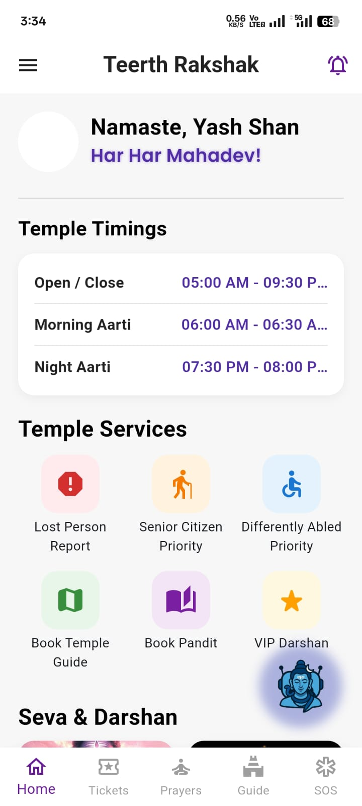
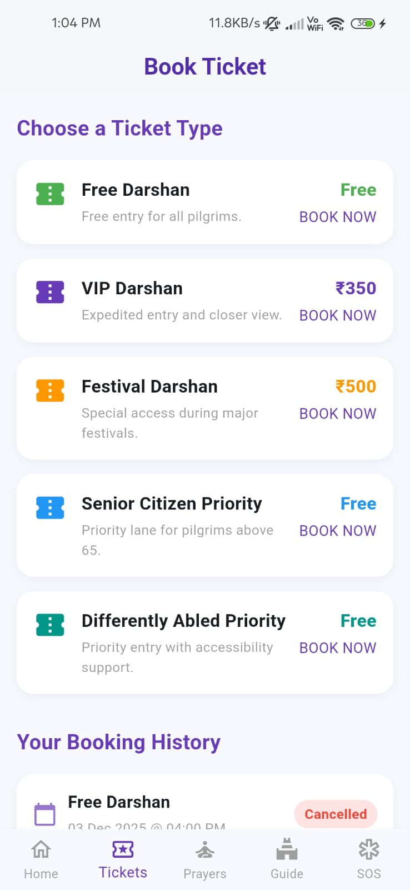
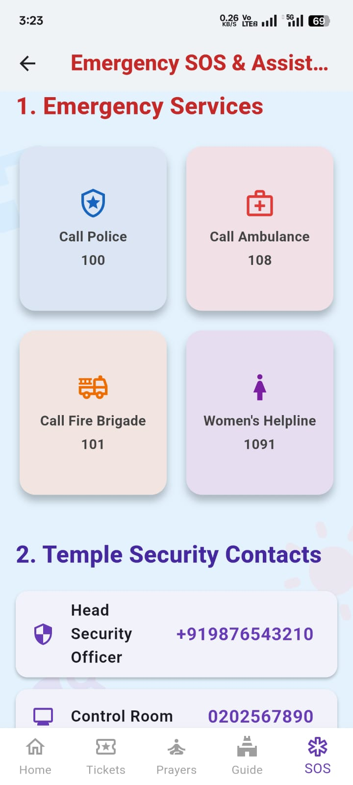
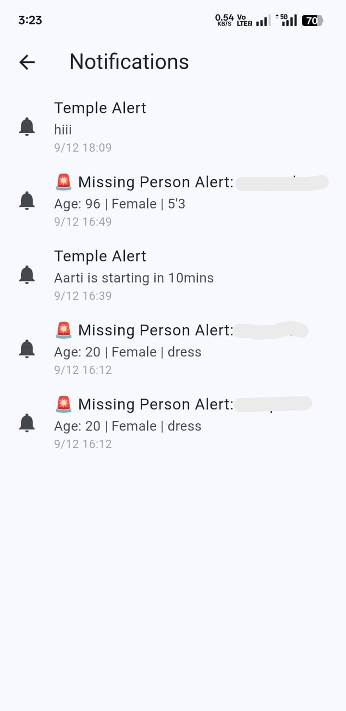
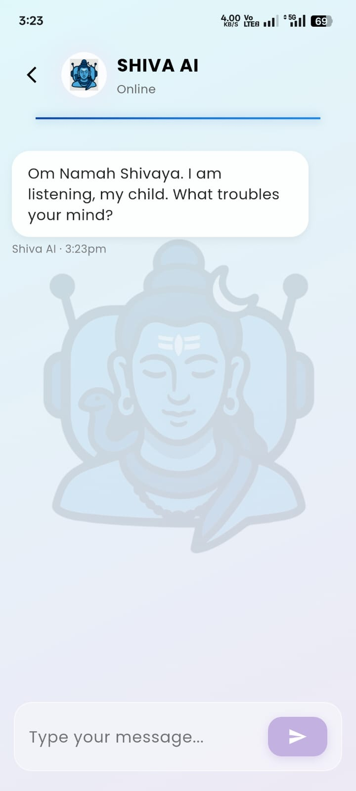
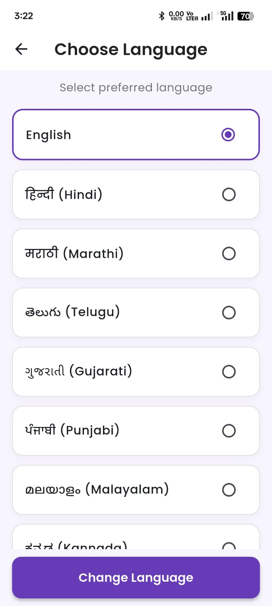
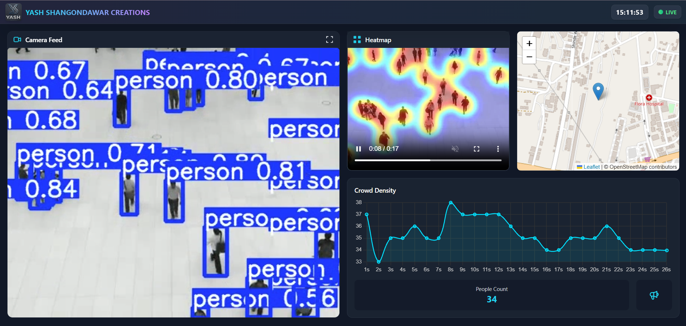
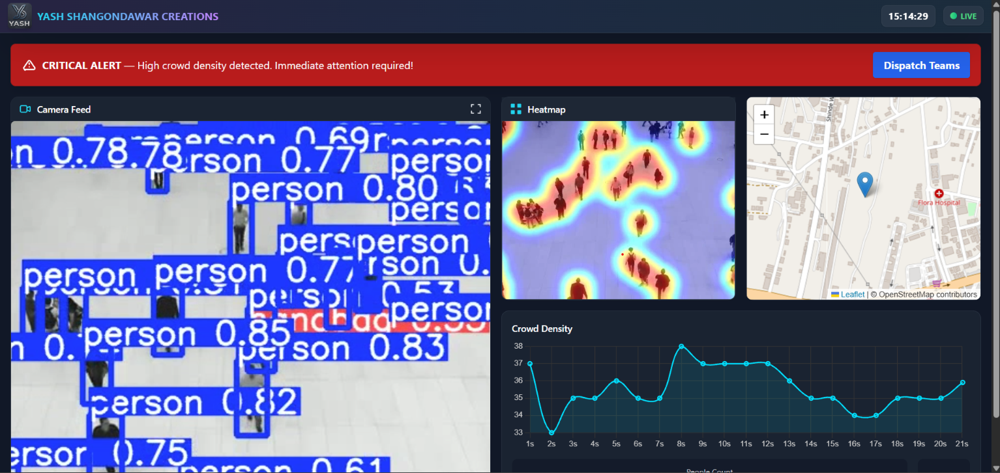

# 🛕 Teerth-Rakshak

### Smart Pilgrimage Management & Crowd Safety Platform

Teerth-Rakshak is a technology-driven platform designed to improve the
**safety, organization, and overall experience of pilgrims during large
religious gatherings**.

The project combines a **Flutter-based mobile application** for pilgrims
with an **AI-powered administrative monitoring dashboard**. The platform
provides digital darshan management, emergency assistance, missing-person
reporting, real-time crowd monitoring, crowd-density visualization, and
AI-powered assistance.

The system follows a **predictive rather than reactive approach to crowd
safety**, using computer vision and crowd-density analysis to help identify
potentially dangerous overcrowding situations early.

> 🏆 Developed as a **Winner — Smart India Hackathon 2025**.

---

## 🎯 Problem

Large religious gatherings can bring together thousands or millions of
pilgrims at the same location. Managing such gatherings manually can lead to
several challenges:

- Increased risk of overcrowding and stampede situations
- Difficulty managing darshan queues and entry
- Delayed response to emergencies
- Difficulty locating missing persons
- Limited real-time visibility for administrators
- Communication challenges with large numbers of pilgrims
- Lack of centralized information and assistance

Teerth-Rakshak addresses these challenges by combining **mobile technology,
cloud services, artificial intelligence, computer vision, and centralized
monitoring**.

---

# 💡 Our Solution

Teerth-Rakshak consists of two major components:

### 📱 Pilgrim Mobile Application

A Flutter-based mobile application that provides pilgrims with essential
services and information from a single platform.

### 🖥️ AI-Powered Administrative Dashboard

A monitoring dashboard that uses computer vision to analyze crowd conditions
and provide administrators with real-time visual insights and alerts.

Together, these components create a technology-assisted ecosystem for safer
and more organized pilgrimage management.

---

# 📱 Mobile Application

The mobile application provides pilgrims with a range of services designed
to simplify their pilgrimage experience and improve emergency preparedness.

## 🏠 Temple Services

The home screen provides quick access to important temple services such as:

- Lost Person Reporting
- Senior Citizen Priority
- Differently Abled Priority
- Temple Guide
- Pandit Services
- VIP Darshan
- Temple timings
- Notifications



---

## 🎟️ Smart Darshan Ticketing

The application provides digital ticket booking for different categories of
darshan.

Supported ticket types include:

- Free Darshan
- VIP Darshan
- Festival Darshan
- Senior Citizen Priority
- Differently Abled Priority

The system also maintains booking history for pilgrims.



---

## 🚨 Lost Person Reporting

Pilgrims can report a missing person through the application by providing
relevant information such as:

- Name
- Age
- Gender
- Height
- Clothing description
- Existing medical conditions
- Relationship to the missing person
- Photograph

This information can be used by the administrative system to assist in
identification and coordination.

---

## 🆘 Emergency & SOS Assistance

The application provides quick access to emergency services and important
support contacts.

### Emergency Services

- Police
- Ambulance
- Fire Brigade
- Women's Helpline

### Temple Support

- Security Officer
- Control Room
- Night Patrol
- Lost & Found Desk
- Medical Assistance
- First Aid Station



---

## 🔔 Real-Time Notifications

The application provides important alerts and updates to pilgrims.

Notifications can include:

- Temple alerts
- Aarti reminders
- Missing-person alerts
- Emergency-related announcements



---

## 🤖 Shiva AI

Teerth-Rakshak includes **Shiva AI**, an AI-powered conversational
assistant integrated into the mobile application.

The assistant provides an interactive interface through which pilgrims can
ask questions and receive AI-generated responses.

The feature is powered by the **Google Gemini API**.



---

## 🙏 Prayers & Devotional Content

The application also provides devotional content including:

- Aarti collections
- Mantras
- Stotras
- Guided chanting
- Meditation content

This allows pilgrims to access devotional resources directly through the
application.

---

## 🌐 Multi-Language Support

The application supports multiple Indian languages to make the platform more
accessible to pilgrims from different regions.



---

## 🛕 Temple Guides & Pandit Services

The application provides information about:

- Temple guides
- Pandits
- Languages spoken
- Areas of expertise
- Experience
- Ratings
- Booking and calling options

This helps pilgrims discover relevant temple services through the platform.

---

# 🖥️ AI-Powered Crowd Monitoring Dashboard

The administrative dashboard is designed to provide real-time visibility
into crowd conditions.

The system processes camera footage using computer vision and presents the
results through an interactive monitoring interface.

---

## 👥 Person Detection

The monitoring system uses **YOLOv8** for detecting people in camera footage.

The detected information is used to determine the current number of people
present in the monitored area.

---

## 🔢 People Counting

The dashboard tracks the detected number of people and displays the current
people count to administrators.

This provides a quick indication of the crowd level in the monitored area.

---

## 🔥 Crowd Heatmap

A heatmap is generated from detected people positions to visualize areas with
higher crowd concentration.

This allows administrators to identify potential crowd hotspots more easily.

---

## 📊 Crowd-Density Analytics

The dashboard visualizes crowd-density information over time through a
dynamic graph.

This helps administrators observe changes in crowd conditions rather than
relying only on a single snapshot.



---

## 🚨 Critical Crowd Alerts

When a high crowd-density condition is detected, the dashboard can display
a prominent critical alert requiring administrative attention.

The dashboard provides an immediate visual indication of potentially
dangerous crowd conditions.



---

# 🔄 Crowd Monitoring Workflow

```text
Camera Feed
     │
     ▼
YOLOv8 Person Detection
     │
     ▼
People Detection & Counting
     │
     ▼
Crowd Density Analysis
     │
     ├──────────────► Heatmap Generation
     │
     └──────────────► Density Analytics
                         │
                         ▼
                  Administrative Dashboard
                         │
                         ▼
                  Critical Crowd Alert

---

# 🏗️ System Architecture

The platform combines the Flutter mobile application, Firebase services,
Google Gemini AI, and the Python/Flask monitoring system.

The mobile application and monitoring dashboard are currently developed as
separate components of the overall solution.


# 🧰 Technology Stack

## 📱 Mobile Application
- Flutter
- Dart
- Firebase Authentication
- Cloud Firestore
- Firebase Storage
- Google Sign-In
- Google Fonts
- easy_localization

## 🤖 Artificial Intelligence & Computer Vision
- Google Gemini API
- YOLOv8
- Computer Vision
- Crowd-Density Analysis
- Heatmap Generation

## 🖥️ Administrative Dashboard
- Python
- Flask
- OpenCV
- Matplotlib
- HTML
- CSS
- JavaScript
- Tailwind CSS
- Leaflet

## ☁️ Cloud & Backend Services
- Firebase Authentication
- Cloud Firestore
- Firebase Storage
- Google Gemini API

# 👨‍💻 My Contributions

I was one of the primary developers responsible for implementing major
technical components of Teerth-Rakshak across both the administrative
dashboard and the pilgrim mobile application.

## 🖥️ Administrative Dashboard & Backend

- Developed the **Python Flask backend** for the administrative monitoring
  system.
- Implemented **YOLOv8-based person detection** for camera footage.
- Implemented automated **people counting** from detected persons.
- Developed **crowd-density analysis** for monitoring crowd conditions.
- Implemented **crowd heatmap generation** to visualize high-density areas.
- Developed **critical crowd-density alert logic** for identifying
  potentially dangerous crowd conditions.
- Worked on the dashboard interface for **real-time crowd monitoring**.
- Integrated computer vision processing with the administrative dashboard.

## 📱 Mobile Application

- Integrated **Firebase Authentication** with the Flutter application.
- Implemented Firebase-based data handling using **Cloud Firestore**.
- Integrated **Firebase Storage** for storing uploaded content.
- Integrated the **Google Gemini API** for the Shiva AI assistant.
- Contributed to Flutter UI development and application screens.
- Worked on multiple pilgrim-facing features including **ticketing,
  emergency services, notifications, and other temple services**.

## 🔧 Overall Project

- Worked across both **frontend and backend development**.
- Contributed to the overall technical architecture and implementation.
- Developed major parts of the **AI-powered monitoring system** and
  **Firebase-integrated mobile application**.
- Contributed to the development of the working prototype presented during
  **Smart India Hackathon 2025**.

# ⭐ Key Highlights

- 🏆 **Smart India Hackathon 2025 Winning Solution**
- 📱 Flutter-based **Pilgrim Mobile Application**
- 🎟️ **Digital Darshan Ticketing** with multiple priority categories
- 🆘 **Emergency SOS & Support Services**
- 👤 **Lost Person Reporting**
- 🔔 **Temple & Emergency Notifications**
- 🤖 **Google Gemini-powered Shiva AI Assistant**
- 🌐 **Multi-Language Support** for pilgrims
- 👥 **YOLOv8-based Person Detection & Counting**
- 🔥 **AI-powered Crowd Heatmap Generation**
- 📊 **Crowd-Density Analytics & Visualization**
- 🚨 **Critical Crowd-Density Alerts**
- 🖥️ **Python & Flask Administrative Monitoring Dashboard**
- ☁️ **Firebase Authentication, Firestore & Storage Integration**
- 👨‍💻 Development across **Flutter, Firebase, Python, Flask, AI & Computer Vision**


# 🏆 Achievement

### Smart India Hackathon 2025 — Winner

Teerth-Rakshak was developed as a winning Smart India Hackathon 2025
solution focused on improving safety, organization, and crowd management
during large-scale religious gatherings..

# ⚠️ Repository Note

This is a public showcase and documentation repository containing
selected project information, architecture, and screenshots.

The complete source code is maintained separately in private repositories.

Sensitive information such as API keys, Firebase credentials, signing
keys, passwords, and private configuration is intentionally excluded.
